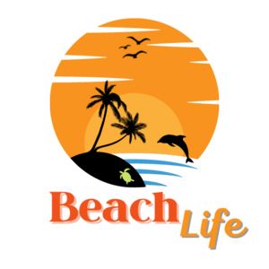
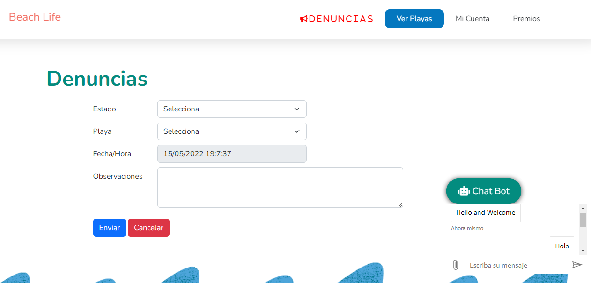
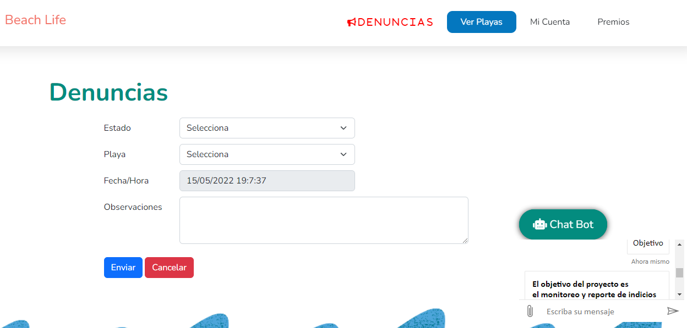

# Beach*Life*  V.1.0

## ¿Qué es Beach*Life*?

Beach*Life* es una Aplicación Web que busca mostrar a turistas, habitantes y Autoridades Locales pertenecientes a Estados de la República Méxicana el status actual en la que se encuentran las playas en materia de contaminación por medio una API realizada por Beach*Life, y* un semáforo que mostrará de acuerdo a los datos que publica COFEPRIS si son aptas para uso  recreativo o no. Además los usuarios de la aplicación pueden calificar el estado de la playa con Puntuaciones del 1 al 5 para compartir con otros usuarios su experiencia y eatado ambiental de la playa en donde se localicen.

Los usuarios tambíen podran realizar Reportes/Denuncias sobre situaciones de contaminación que detecten, estos reportes serán procesados y validados para porteriormente ser enviados a las autoridades correspondientes. Además posteriormete los usuarios podrán obtener recompensas a cambio de sus contribuciónes a la limpieza de playas, campañas de concientización y acciones que conlleven a la preservación de las playas mexicanas.

## ¿Cómo se visualiza el estado de contaminación de las playas?

La aplicación por medio de la ubicación del usuario y una API realizada por el equipo de BeachLife, mostrará al usuario un mapa con marcadores dependiendo el color /*DEFINIR LOS COLORES*/  estos colores representan el grado de contaminación de acuerdo a los esterocos encontrados por cada 100 mlilitros.

Para fines de información los colores representan lo siguiente:

* Amarillo:  /100ml
* Rojo /100ml
* Verde: /100ml
* Naranja: /100ml

## ¿Para qué sirven los Reportes/Denucias?

Los reportes realizados por los usuarios tienen la finalidad de recabar problemas de contaminación que sean detetados en las areas donde se encuentren, al realizar un reporte este será analizado para ver su relevancia y porteriormente hacerle llegar a las autoridades correspodientes, al realizar reportes afectará la calificación de la playa, por lo que las autoridades tendrán un punto que deben cubrir si sus playas reciben malas puntuaciones.

## ¿Cómo funciona el sistema de puntos?

Sabemos que es dificil generar conciencia sobre el cuidado de las playas y los oceanos, es por ello que en actualizaciónes posteriores   se busca lograr una colaboracón con las autoridades, dueños de pequeñas, medianas y grandes empresas como Restuarantes, Prestadores de Servicios Turísticos y Hoteles para que brinden premios a los usuarios que por medio de la aplicacón suban pruebas de actividades que beneficien a la conservación de las playas y oceanos.

Cada actividad que los usuarios les generará puntos acumulables, los cuales podrán intercambiar por algún beneficio que ofrezcan los establecimientos antes mencionados (el costo de puntos de los premios será acordado por el establecimiento ).

Las actividades para generar puntos pueden ser las siguentes:

* Limpieza de un área determinada de la playa
* Campañas de concientización
* Participación en talleres
* Realizar reportes

## Progreso de la versión actual

La aplicación se encuentra en fase de desarrollo, por lo que la integración de puntos no está aun disponible

 A continuación se presenta una lista de lso puntos que contiene el proyecto final marcando con ✔️ los cumplidos y con una ❌ los que aún están en fase de desarrollo

* Creación de la API para brindar los datos que publica COFEPRIS (Los datos de COFEPRIS se publican en archivos PDF por lo que no es posible consumirlos, es por ello que se está ceando esta API para consumir los datos) ✔️
* Creación del Formulario de Reportes ✔️
* Uso de la API de Google Maps para mostrar el Mapa con la ubicación del usuario ✔️
* Visualizacíon de las playas con marcadores de colores del semaforo ✔️
* Implementación del sistema de recompensas ❌
* Implentación del sistema de calificación de las playas por parte de los usuarios ❌

## Chat-Bot - CREACIÓN
Se creo el Chat-Bot mediante Azure

Contiene un asistenten virtual llamado Chat-Bot, el cual ayuda a los usuario en cuestiones de usuo de la aplicación mediante palabras clave. 
La palabra para inicializar el Chat-Bot es "Hola". 

Un ejemplo de ello, te proporciona el Objetivo del proyecto al escribirle Objetivo.

## Sistema de geolocalización con Base de datos en Azure

## API playas de México
En México contamos con 11,122km de longitud de costa, en el cual algunos organismos del Estado Mexicano realizan pruebas para medir la contaminación en las playas, esta información se difunde en imágenes o archivos PDF en los sitios oficiales de gobierno, y es utilizado en su mayoría por medios de comunicación y algunos turistas para considerar antes de realizar algún viaje.

Repositorio de la API --> https://github.com/jivancm/playas-mex-api

Esta API tiene la intención de ser una fuente de información que permita a diferentes sectores de la sociedad obtener la información de una manera más digerible.

Se cuenta con un padrón de 387 playas ubicadas 76 municipios de 19 entidades de la república.

stos son las rutas que están disponibles para ser consumidas:

Playas
https://apiplayasmx.herokuapp.com/playas

En esta ruta se devuelve un JSON con la siguiente estructura:
[ { "id": 1, "nombrePlaya": "Playta de Rosarito", "latitud":32.33555556, "longitud":-117.0577778 }, ... ]

Municipios y estados
https://apiplayasmx.herokuapp.com/municipios
https://apiplayasmx.herokuapp.com/estados
La idea de estos endpoints es la de devolver las playas que se encuentran en esos lugares.

Clasificación
https://apiplayasmx.herokuapp.com/clasificaciones

Es la calificación o evaluación obtenida por COFEPRIS o SEMARNAT, y que está publicada en diferentes sitios de gobierno.

[ { "id":1, "nombreClasificacion":"APTA", "npm":150, "fechaActualizada":"2022-03-17", "idPlaya":{ "id":1, "nombrePlaya":"Playa de Rosarito", "latitud":32.33555556, "longitud":-117.0577778 } }, ... ]

